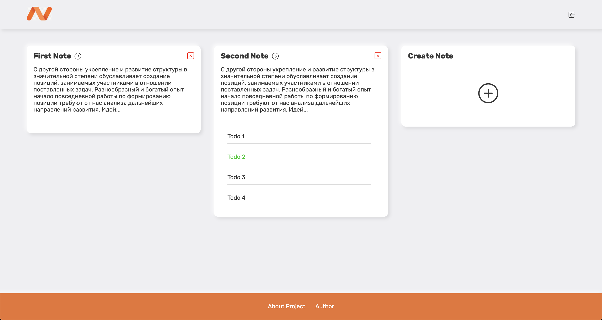

# Notee

Simple SPA application for creating notes and todos.

### Stack
- Nuxt 
- Express
- MongoDB

[Notee app link](https://notee.qweb.by/)



## Build Setup

```bash
# install dependencies
$ yarn install

# serve with hot reload at localhost:3000
$ yarn dev

# build for production and launch server
$ yarn build
$ yarn start

# generate static project
$ yarn generate
```
